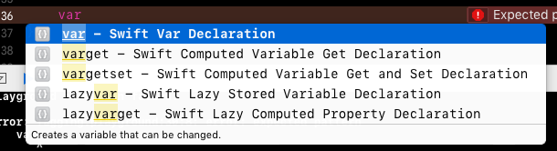
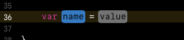

## CodeSnippets-Swift  

        
        
***CodeSnippets*** - w *xcode* są to fragmenty tekstu używane przez funkcję automatycznego uzupełniania, które *xcode* podpowiada, gdy w edytorze zaczniemy wpisywać znany mu ciąg znaków. Jeśli już używałeś *xcode* na pewno miałeś z nimi do czynienia

Poniżej fragment widoku edytora podczas wpisywania słowa `var`. Widać okno z listą podpowiedzi, z której za pomocą strzałek na klawiaturze i przycisku `return` można wybrać snippet:

Widok po wybraniu pierwszego podpowiadanego snippeta, w tym przypadku jest on jednym z wielu zdefiniowanych od nowości w *xcode*:

Na powyższym zdjęciu widać dwa placeholdery[1](#f_placeholder): `name` i `value`, które należy zastąpić odpowiednio nazwą zmiennej i jej wartością początkową.

---
Snippety[2](#f_snippet) w tym repozytorium podzielone są na kategorie, nazwa kategorii jest też przedrostkiem skrótu[3](#f_shortcut) snippeta i nazwy pliku.

- `usr` - zwykłe fragmenty

- `rx` - fragmenty wspierające programowanie przy użyciu RxSwift
- `rlm` - fragmenty wispierające używanie biblioteki RealmSwift

- `impl` - teksty całych implementacji class, struktur, itd.
- `ext` - teksty całych plików implementacji rozszerzeń

	Wrzucam całe implementacje różnych rozwiązań jako snippety, ponieważ pisząc nowy projekt nie zawsze mam dostęp do projektów, które pisałem wcześniej czy do mojego projektu bazowego, natomiast snippety wystarczy zrobić *commit* na github, po tym, gdy dodam nowy po czym zrobić *checkout* (bądź sklonować, jeśli jeszcze tego nie zrobiłem do katalogu ze snippetami xcode na innym komputerze) i wszystkie fragmenty kodu mam dostępne od razu. Przy czym należy pamiętać, że jeśli updatuje się snippety, gdy aplikacja *xcode* jest uruchomiona konieczny jest jej restart, żeby wczytała je na nowo.
	
- `example` - przykłady, najczęściej przykłady implementacji jakiś rozwiązań nie będące ich szablonami

- `mark` - wstawiają komentarze `// MARK: - <#nazwa etykiety#>
- `mit` - teksty i nagłówki dotyczące licencji MIT

- brak przedrostka - mogą się zdarzyć fragmenty bez przedrostka, najczęściej bardzo krótki, często używane o bardzo skrótowych skrótach, które trzeba po prostu znać, by ich szybko użyć.

### Lista
TBD

## Licencja
Użyłem tu licencji MIT ale tylko z przyczyn formalnych, gdyż publikuje fragmenty kodu i dla większych fragmentów kodu, jeśli takie się tu znajdują a nie zawierają licencji ma zastosowanie licencja MIT

Jednak prawda jest taka, że gdy fragmenty te są bardzo małe albo nie superinnowacyjne prawa autorskie i tak nie mają zastosowania wiec... Natomiast *Attribution* w przypadku MIT jest wymagane jeśli byście publikowali w całości bądź zmieniony kod, natomiast jeśli używacie jakiegoś skrawka w postaci snippetu nie popadajmy w skrajności, a skompilowanego kodu i tak nikt nie sprawdzi.

---

1. ***Placeholder***, czyli *symbol zastępczy*, jest to określony tekst (ciąg znaków), który aplikacja zna i jest w stanie znaleźć jego wystąpienia w większym tekście a następnie zastąpić je przypisanymi wartościami.  *Placeholderem* nazywa się też szary tekst wyświetlany w polu tekstowym (UITextField) gdy pole jest puste, najczęściej będący wskazówką co w to pole powinno zostać wpisane. [↩](#a_placeholder)

2. ***Snippet*** czyli *skrawek*, fragment, w tym przypadku fragment kodu albo po prostu tekstu, ponieważ nie musi on być kodem. Snippety to też coś w rodzaju template'ów[4](#f_template), gdyż mają placeholdery, które sugerują że powinny być zastąpione konkretną nazwą, np. nazwą klasy [↩](#a_snippet)

3. ***Shortcut***, czyli skrót, w przypadku snippetu jest to tekst który należy zacząć wpisywać by xcode podpowiedział/zasugerował nam użycie tego snippeta [↩](#a_shortcut)

4. ***Template***, czyli *szablon* [↩](#a_template)

